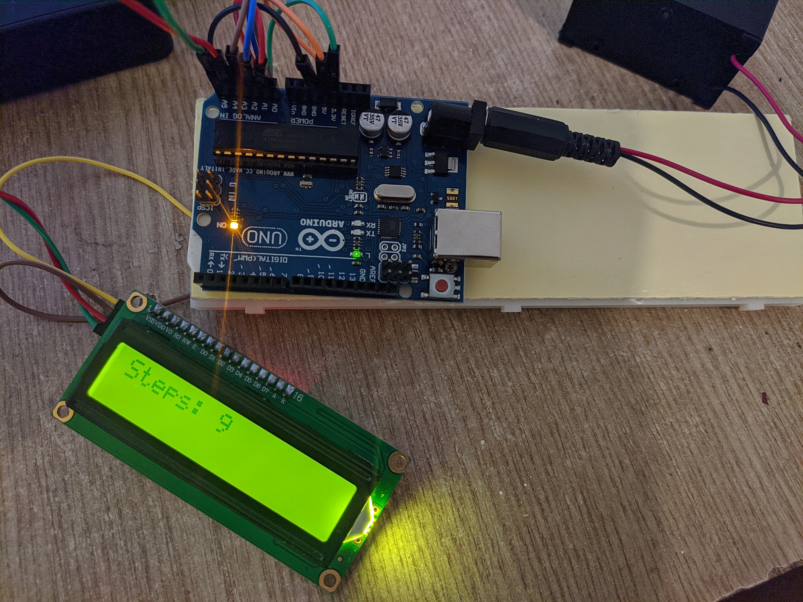

# Pedometru-Proiect-SMP
Realizarea unui pedometru folosind placa de dezvoltare Arduino Uno si accelerometrul ADXL337

# Introducere
Proiectul constă în implementarea unui pedometru, un aparat cu care se pot măsura numărul de pași cu ajutorul unui accelerometru.

# Componente
- Arduino Uno R3 ATmega328P
- Senzor accelerometru ADXL337
- Ecran LCD 16x2 cu interfață I2C
- Breadboard 830 puncte
- Baterie 9V
- Jumpere

# Funcționare
Accelerometrul ADXL337 are 5 pini, unul pentru VCC, altul pentru ground și 3 pini ce oferă ca output valori de ieșire pentru axele X, Y, Z.

La pornirea dispozitivului, se pornește procedura de calibrare a accelerometrului prin funcția calibrate(), prin care se citesc 100 de valori venite de la acesta și se face o medie pentru fiecare axă. 

Odată făcută calibrarea, se intră în loop() unde se citesc 100 de valori odată la 200ms, și este calculat coeficientul prin care se determină dacă a avut loc deplasarea. Formula pentru acest coeficient este:
√((acc_x-avg_x )^2+(acc_y-avg_y )^2+(acc_z-avg_z )^2 )
unde avg_x, avg_y, avg_z sunt valorile medii calculate în funcția calibrate. 

După ce a fost calculat acest coeficient, se verifică dacă acesta este mai mare decât un threshold prestabilit, care în cazul de față este 9. Dacă valoarea este mai mare ca threshold-ul, se crește numărul de pași și se afișează pe ecran. Pentru a împiedia creșterea infinită a numărului de pași, se folosește variabila flag, care este setată cu 1 atunci când se crește numărul de pași, și se setează înapoi cu 0 atunci când coeficientul scade sub threshold. În acest fel, se face o verificare suplimentară după ce se verifică dacă coeficientul e mai mare ca threshold-ul, flag-ul trebuie să fie de asemenea 0, altfel nu se va crește numărul de pași.
Pentru afișare s-a folosit un ecran LCD 16x2 de care este atașat un modul de interfațare I2C, pentru a ocupa mai puțini pini pe placa Arduino.
# Bibliografie
-	https://circuitdigest.com/microcontroller-projects/diy-arduino-pedometer-counting-steps-using-arduino-and-accelerometer
-	https://github.com/sparkfun/ADXL337_Breakout/blob/master/firmware/ADXL337_example/ADXL337_example.ino
-	https://create.arduino.cc/projecthub/brudarko/pedometer-arduino-101-ef494b

